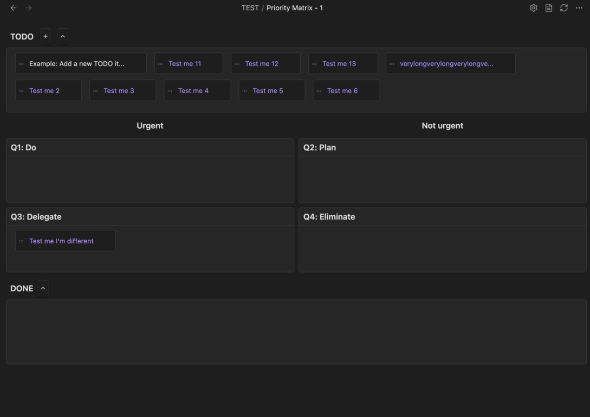
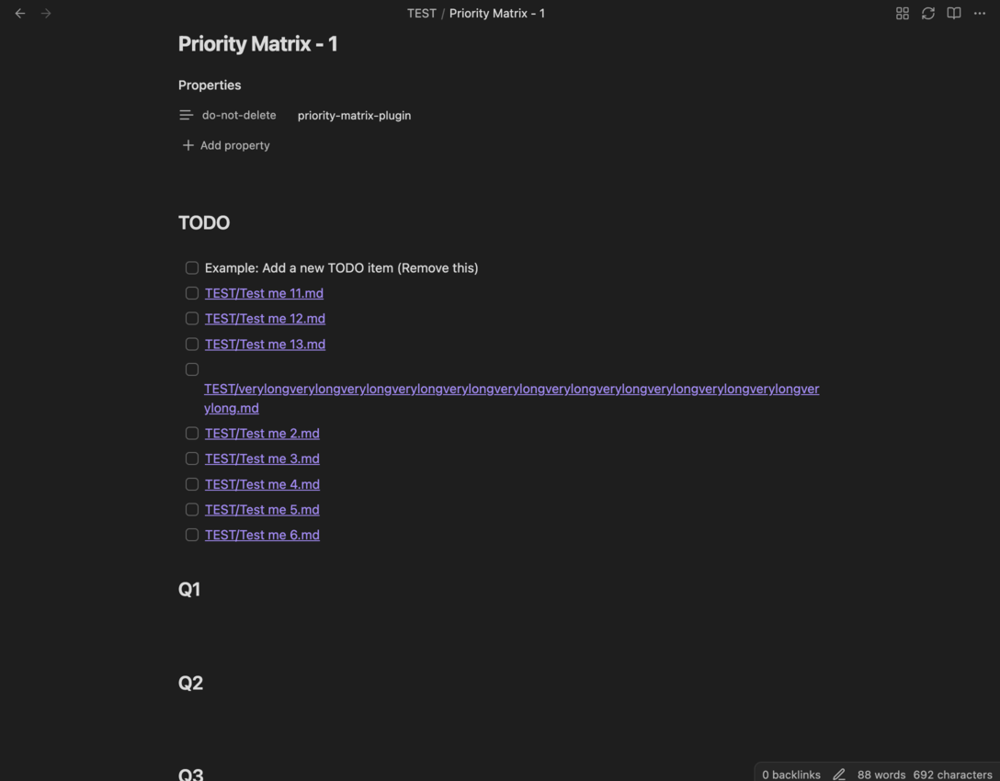
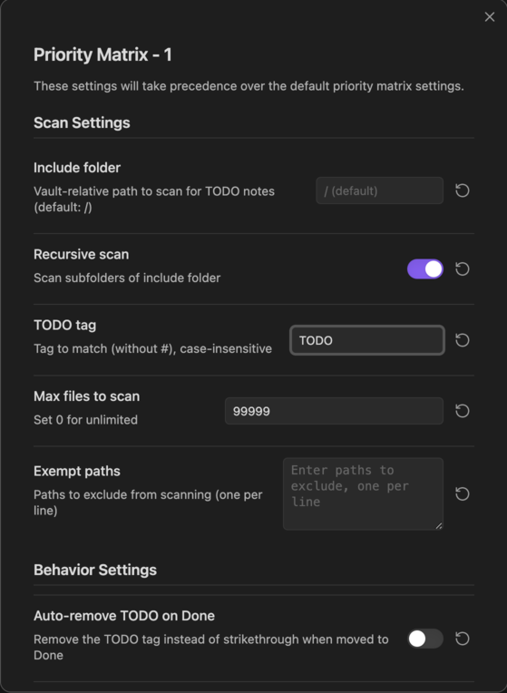

# Priority Matrix Obsidian Plugin (In Progress)

An Obsidian plugin that creates and manages Eisenhower priority matrix notes with automatic TODO sourcing from your vault.

## Features

- **Matrix View**: Visualize your tasks in a 2x2 priority matrix (Urgent/Important, Urgent/Not Important, Not Urgent/Important, Not Urgent/Not Important)
- **Automatic TODO Sourcing**: Automatically scans your vault for tasks tagged with `#TODO` and displays them in the matrix, or you can add your own tag to scan
- **Interactive Task Management**: Drag and drop tasks between quadrants to reprioritize, mark tasks as done, and manage your workflow
- **Custom Matrix Notes**: Create new priority matrix notes with a single command
- **Auto-Switch View**: Automatically opens files with "priority matrix" in the name in matrix view
- **Flexible Configuration**: Customize scan paths, TODO tags, and behavior settings
- **Markdown Integration**: Matrix notes are stored as markdown files, fully compatible with Obsidian's native features

## Installation

(Not yet released there)
### From Obsidian Community Plugins

1. Open **Settings** → **Community plugins**
2. Make sure Safe mode is **off**
3. Click **Browse** and search for "Priority Matrix"
4. Click **Install**, then **Enable**

### Manual Installation

1. Download the latest release from the [GitHub repository](https://github.com/murtazaraza/prioritymatrix-obsidian)
2. Extract the zip file and copy the `main.js`, `manifest.json`, and `styles.css` files to your vault's `.obsidian/plugins/priority-matrix/` folder
3. Reload Obsidian
4. Enable the plugin in **Settings** → **Community plugins**

## Usage

### Creating a Priority Matrix Note
1. Right-click on a folder in the file explorer and select **New priority matrix note**

Alternatively, you can:
1. Open the command palette (`Ctrl+P` / `Cmd+P`)
2. Run **Create priority matrix note**
3. A new note with the matrix template will be created in the current folder

### Working with the Matrix

- **Customise Settings**: Customize the folder to scan, change your tag to scan, add exempted notes
- **View Tasks**: Tasks from your vault tagged with `#TODO` will automatically appear in the matrix on refresh. Or simply press the refresh icon
- **Move Tasks**: Drag tasks between quadrants to reprioritize them
- **Mark as Done**: Move tasks to the Done bank to mark them as complete
- **Edit Tasks**: Click on tasks to edit them directly in their source files
- **Switch Views**: Toggle between matrix view and markdown view using the view switcher

### Matrix Quadrants

The Eisenhower Matrix organizes tasks into four quadrants:

- **Q1 (Urgent & Important)**: Do these tasks immediately
- **Q2 (Not Urgent & Important)**: Schedule time for these tasks
- **Q3 (Urgent & Not Important)**: Delegate these if possible
- **Q4 (Not Urgent & Not Important)**: Consider eliminating these tasks

## Configuration

Access plugin settings via **Settings** → **Priority Matrix**.

### Scan Settings

- **Include folder**: Vault-relative path to scan for `#TODO` notes (default: `/` for entire vault)
- **Recursive scan**: Enable to scan subfolders of the include folder
- **TODO tag**: Tag to match (without `#`), case-insensitive (default: `TODO`)
- **Max files to scan**: Limit the number of files to scan (set to `0` for unlimited)

### Behavior Settings

- **Auto-remove TODO on Done**: Remove the `#TODO` tag when a task is moved to Done (instead of strikethrough)
- **Strikethrough TODO on Done**: Replace `#TODO` with `~~#TODO~~` when moved to Done (disabled if auto-remove is enabled)

## Requirements

- Obsidian v0.15.0 or higher
- No additional dependencies required

## Troubleshooting

### Tasks Not Appearing

- Ensure your tasks are tagged with `#TODO` (or the tag you configured in settings)
- Check that the **Include folder** setting includes the path where your TODO notes are located
- Verify that **Recursive scan** is enabled if your TODOs are in subfolders
- Check the **Max files to scan** setting isn't limiting the scan
- Make sure property [do-not-delete:priority-matrix-plugin] has not been removed

### Matrix View Not Opening

- Files with "priority matrix" in the name will automatically open in matrix view
- Ensure the file contains a priority matrix code block or frontmatter

### Plugin Not Loading

- Verify the plugin is enabled in **Settings** → **Community plugins**
- Check that `main.js`, `manifest.json`, and `styles.css` are in the correct folder: `.obsidian/plugins/priority-matrix/`
- Try reloading Obsidian (`Ctrl+R` / `Cmd+R`)

## Contributing

Contributions are welcome! Please feel free to submit a Pull Request. For major changes, please open an issue first to discuss what you would like to change.

## License

This project is licensed under the MIT License - see the [LICENSE](LICENSE) file for details.

## Support

For issues, feature requests, or questions:
- Open an issue on the [GitHub repository](https://github.com/murtazaRaza/prioritymatrix-obsidian)
- Check existing issues and discussions for solutions
